```{r setup, include=FALSE}
knitr::opts_chunk$set(echo = F, warning = FALSE, message = FALSE, tidy = TRUE, size = "footnotesize")
options(width = 50, max.print=15)
```

# Quelques révisions rapides : Modèles et intervalles de confiance

##


## Quel est le but des analyses statistiques?

Créer un **modèle** (une simplication) qui reproduise le plus fidèlement les données observées dans la réalité à des fins:  
- d'explication  
- de prédiction  

## Modèles statistiques

- Fondamentalement toujours la même chose:  
$Observation_i = PrédictionDuModèle + erreur_i$

### Fit de notre modèle

$Déviation = \sum (Observation - PrédictionDuModèle)^2$


## Exemple basique: la moyenne comme modèle

10 étudiants, nombre de minutes par semaine passées à étudier les stats.

```{r, echo=F }
set.seed(3)
zz <- data.frame(id=paste("p", 1:10, sep=""), minutes=round(rnorm(10, 120, sd=30)))
zz
```

Notre modèle (la moyenne): `r round(mean(zz$minutes))`

##

```{r, echo=F }
plot(zz$id, zz$minutes, ylim=c(60,180))
abline(a=mean(zz$minutes), b=0, col="red")
text(zz$id, zz$minutes+10, label=as.character(round(zz$minutes-mean(zz$minutes))))
```

## Fit de notre modèle? {.build}

- Déviation, aussi sous le nom "sum of squares (SS) error".  
$\sum(minutes - moyenne)^2$ = `r sum((zz$minutes-mean(zz$minutes))^2)`  
- Les SS augmentent avec le nombre d'observations, alors on divise par N-1  
$\frac{\sum(minutes - moyenne)^2}{N-1}$ = `r round(var(zz$minutes))`  
- C'est à dire la variance.  
- Pour l'avoir dans les unités d'origine, on prend la racine carrée:  
$\sqrt\frac{\sum(minutes - moyenne)^2}{N-1}$ = `r round(sd(zz$minutes))` minutes  
- C'est à dire l'écart type (standard deviation, SD). 

## Un fit plus ou moins bon (+/- variabilité)

<div class="two-column">
```{r, echo=F, out.width="100%"}
plot(zz$id, zz$minutes, ylim=c(0,240))
abline(a=mean(zz$minutes), b=0, col="red")
text(zz$id, zz$minutes+10, label=as.character(round(zz$minutes-mean(zz$minutes))))
```

```{r, echo=F, out.width="100%"}
set.seed(3)
zz1 <- rnorm(10, mean=120, sd=90)
plot(zz$id, zz1, ylim=c(0,240))
abline(a=mean(zz$minutes), b=0, col="red")
text(zz$id, zz1+10, label=as.character(round(zz1-mean(zz$minutes))))
```
</div>

Notre modèle, la moyenne, a un meilleur fit à gauche, il est plus fidèle à la réalité.

## Visuellement

On peut voir ces différences en regardant la distribution des données.

<div class="two-column">
```{r, echo=F, out.width="100%"}
hist(rnorm(1000, mean=120, sd=10), xlim=c(0,250), ylim=c(0,200), main="", breaks =20, xlab="SD=10")
```

```{r, echo=F, out.width="100%"}
hist(rnorm(1000, mean=120, sd=30), xlim=c(0,250), ylim=c(0,200),main="", breaks=20, xlab="SD=30")
```
</div>

## Au delà de notre échantillon

Si l'on prenait 1000 échantillons d'étudiants dans différentes universités:

* Moyenne échantillon 1: 123 minutes  
* Moyenne échantillon 2: 102 minutes  
* Moyenne échantillon 3: 144 minutes  
* ...  
* Moyenne échantillon 100: 118 minutes

## Distribution d'échantillonnage (sampling distribution)

```{r, echo=F, out.width="60%"}
hist(rnorm(1000, mean=120, sd=20), xlim=c(0,250), ylim=c(0,200), main="", xlab="")
abline(v=120, col="red", lwd=4)
```

- Moyenne des moyennes de tous ces échantillons: 120 minutes  
- Moyenne $\mu$ de la population: 120 minutes  

## Variabilité de cette distribution d'échantillonnage

$SE (StandardError) = SD_{MoyennesTousÉchantillons}$

- Indique dans quelle mesure un échantillon est représentatif de la population.  

## Central limit theorem (Théorème de la limite centrale)

Malheureusement, rarement accès à 1000 échantillons !

$Moyenne_{Population}=\mu = Moyenne_{TousÉchantillons}$

$SD_{Population}=\sigma = SE = \frac{SD_{echantillon}}{\sqrt N}$

On ne connait pas le reste, mais nous avons accès à la SE!

*Note: valable pour échantillons >30*

## Pourquoi est-ce que c'est utile ?

* Mesure de la "représentativité" de notre échantillon par rapport à la population (sans avoir à recueillir 1000 échantillons!)  
* S'applique aux moyennes mais aussi à toutes les autres statistiques (e.g., $\beta$)  

## Intervalles de confiance

Distribution normale ($z$)

```{r, echo=F, out.width="60%"}
plot(seq(-3,3, .1), dnorm(seq(-3,3, .1), mean=0, sd=1), type="l", xlab="M=0, SD=1", ylab="")
polygon(x=c(-2,seq(-2,2,.1),2), y=c(0,dnorm(seq(-2,2, .1), mean=0, sd=1),0), col="lightgray")
abline(v=0, col="red")
abline(v=c(-2,2), col="blue")
```

- 95% de la distribution entre les lignes bleues  

##
On utilise le théorème de la limite centrale pour construire nos intervalles de confiance

- $LimiteInf95\% = Moyenne_{échantillon} - 1.96*SE$   
- $LimiteSup95\% = Moyenne_{échantillon} + 1.96*SE$  

Si l'on prenait 100 échantillons, 95 des intervalles de confiance contiendraient la moyenne de la population.

# R de base

##

## Console
```{r, out.width="80%"}
knitr::include_graphics("rbase1.jpg")
```

## Créer un fichier de syntaxe
```{r, out.width="80%"}
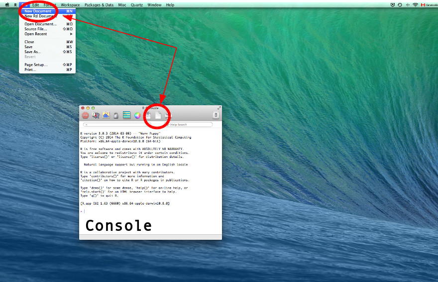
```

## Éditeur
```{r, out.width="80%"}
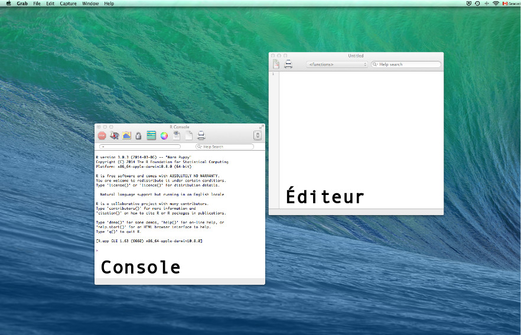
```

# R commander

##

## Démarrer R commander
- Dans la console de R (pas Rstudio), exécuter la commande  
- i.e., presser "Entrée"
```{r echo=T, eval=FALSE}
library(Rcmdr)
```

##
```{r, out.width="60%"}
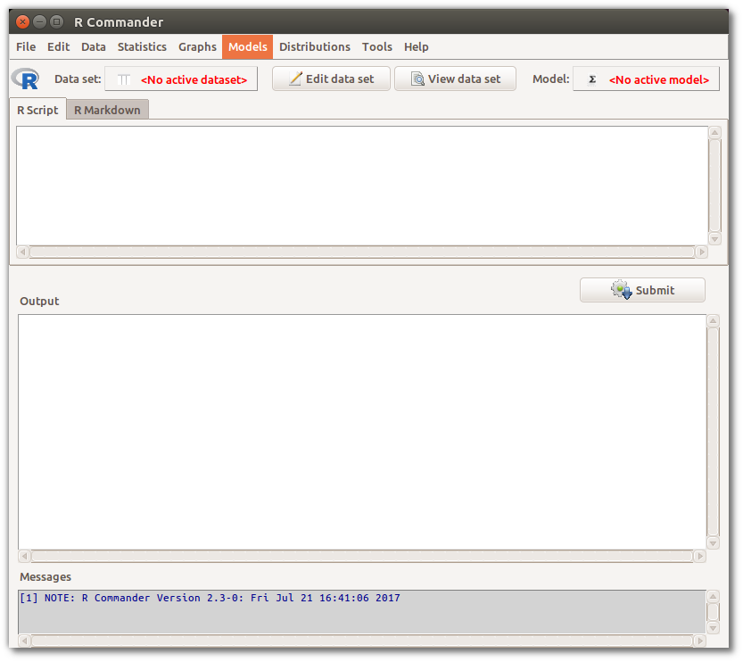
```

## Jeu de données d'exemple
600 immigrants de première génération

```{r}
ss <- read.table("datasetImmigration.txt")

ss[sample(1:nrow(ss), 10),]
```

## Importer des données
```{r, out.width="60%"}
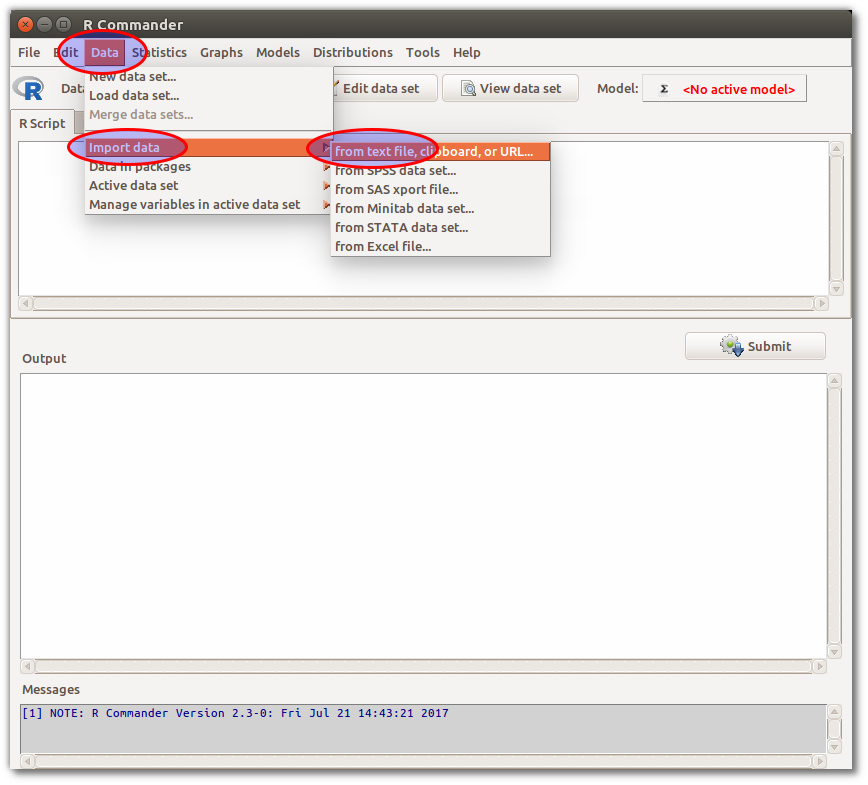
```

##
### Spécifier les charactéristiques du jeu de données
```{r, out.width="40%"}
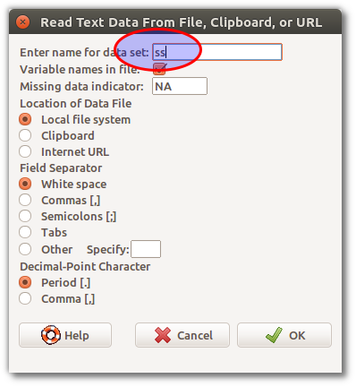
```

##
### Éléments à noter
```{r, out.width="60%"}
knitr::include_graphics("rcmdr_import_data3.png")
```

##
### Voir les données
```{r, out.width="60%"}
knitr::include_graphics("rcmdr_view_data.png")
```

##
### Modifier/éditer les données
<center><b> ATTENTION ! À ÉVITER ! </center></b>
```{r, out.width="60%"}
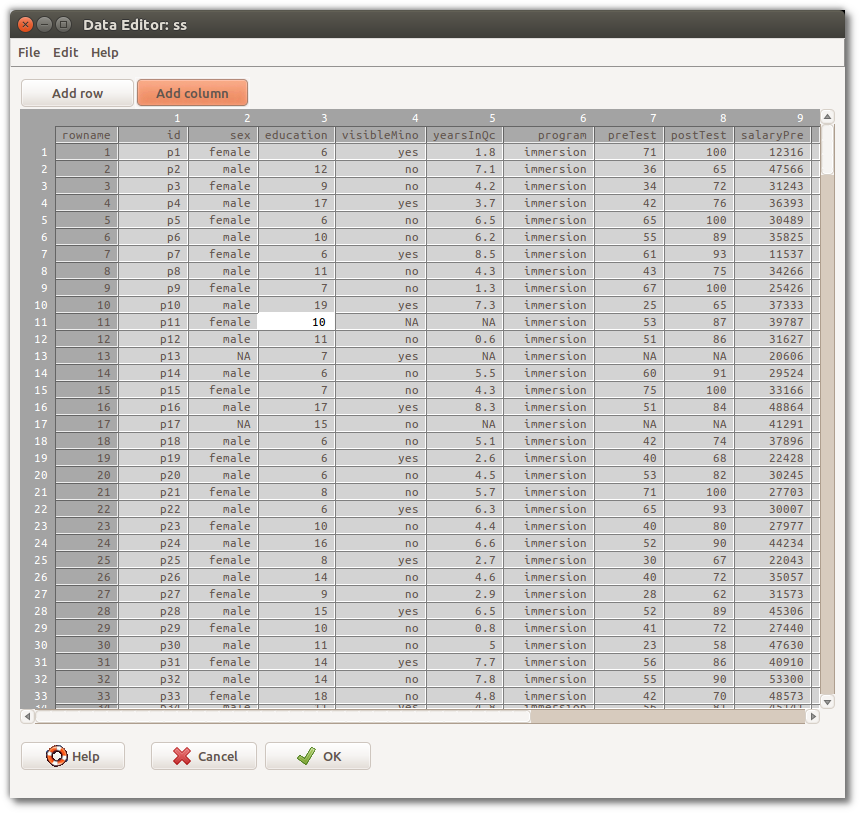
```

## Exemple 1: Valeurs descriptives
```{r, out.width="60%"}
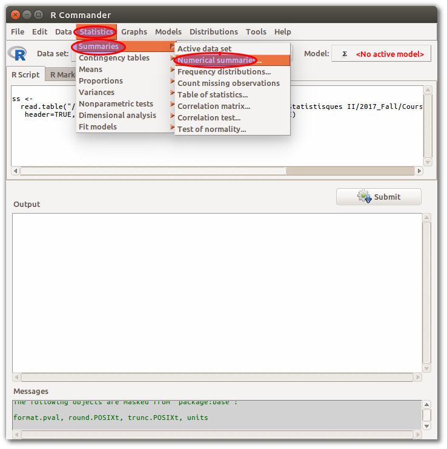
```

##
### 1) Choisir les variables
```{r, out.width="60%"}
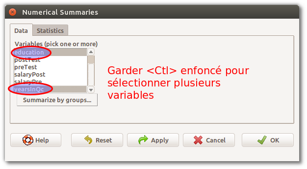
```

##
### 2) Spécifier les valeurs désirées
```{r, out.width="60%"}
knitr::include_graphics("rcmdr_numsum3.png")
```


##
### Résultats
```{r, out.width="60%"}
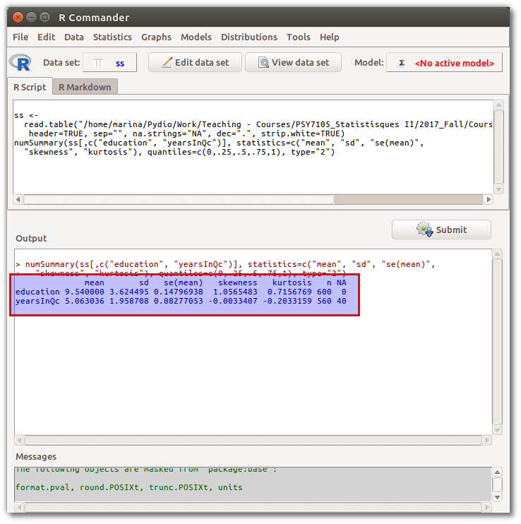
```


## Exemple 2: Recoder une variable
```{r, out.width="60%"}
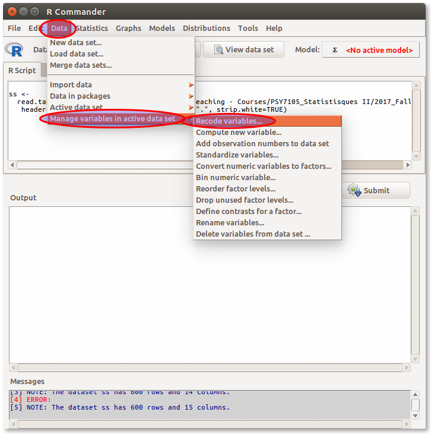
```

##
```{r, out.width="60%"}
knitr::include_graphics("rcmdr_recode1.png")
```

## Exemple 3: Calculer une nouvelle variable
```{r, out.width="60%"}
knitr::include_graphics("rcmdr_computenew.png")
```

##
```{r, out.width="60%"}
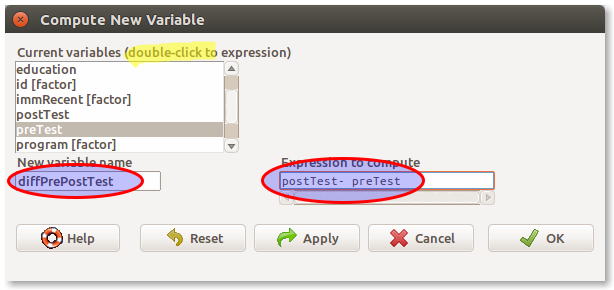
```

## Exemple 4: Spécifier un sous-ensemble
```{r, out.width="60%"}
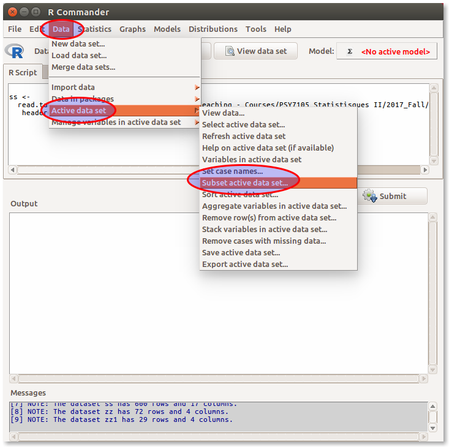
```

##
```{r, out.width="40%"}
knitr::include_graphics("rcmdr_subset1.png")
```

## Exemple 5: Test de t
```{r, out.width="60%"}
knitr::include_graphics("rcmdr_ttest1.png")
```

##
### Onglet "data": 
Choisir la variable dépendante et la variable groupe
```{r, out.width="60%"}
knitr::include_graphics("rcmdr_ttest2.png")
```

##
### Onglet "options":
Spécifier les paramètres du test
```{r, out.width="60%"}
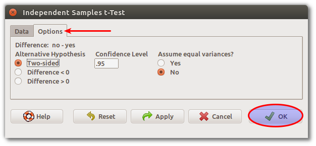
```

##
### Résultats
```{r, out.width="60%"}
knitr::include_graphics("rcmdr_ttest4.png")
```


## Sauvegarder syntaxe et résultats
```{r, out.width="60%"}
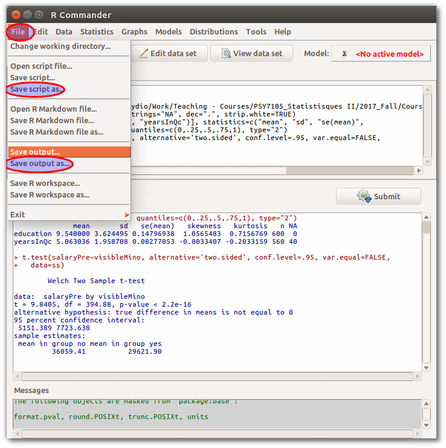
```

## Exporter les données
```{r, out.width="60%"}
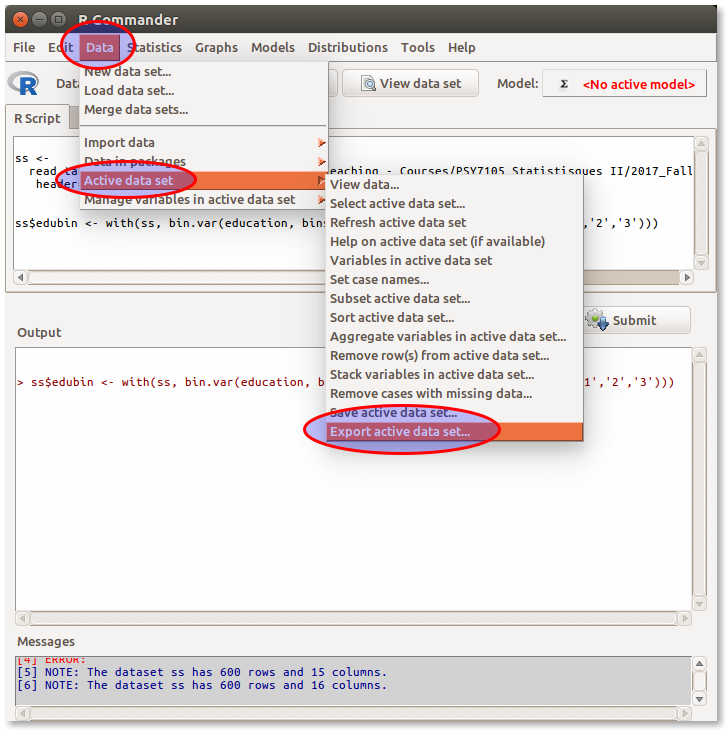
```

##
```{r, out.width="40%"}
knitr::include_graphics("rcmdr_export1.png")
```

```{r, out.width="40%"}
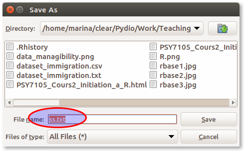
```

# RStudio

##


## Tour d'horizon
```{r, out.width="80%"}
knitr::include_graphics("rstudio1.png")
```

##
```{r, out.width="80%"}
knitr::include_graphics("rstudio2.png")
```

##
```{r, out.width="80%"}
knitr::include_graphics("rstudio3.png")
```

##
```{r, out.width="80%"}
knitr::include_graphics("rstudio4.png")
```

## Ctl + Entrée

Raccourci clavier exécutant la ligne de commande active (là où se trouve le curseur) ou la section de code sélectionnée.

## L'environnement de R

### 1) Installer des modules
```{r, out.width="80%"}
knitr::include_graphics("rstudio_installpackages.png")
```

##
```{r, out.width="80%"}
knitr::include_graphics("rstudio_installpackages1.png")
```

## 

#### Ou par syntaxe

```{r, eval=F, echo=T}
install.packages("car", dependencies = TRUE)
```

- `dependencies=TRUE`: assure que les autres modules nécessaires seront installés aussi.

##
### 2) Charger un module en début de session

```{r, out.width="80%"}
knitr::include_graphics("rstudio_loadpackages.png")
```

## 

#### Ou par syntaxe

```{r, eval=F, echo=T}
library(car)
```

##
### 3) Spécifier le répertoire de travail
```{r, out.width="80%"}
knitr::include_graphics("rstudio_setwd.png")
```

##
### 4) Obtenir de l'aide
Exécuter la commande suivante dans la console
```{r, echo=T}
help(lm)
```

##
```{r, out.width="80%"}
knitr::include_graphics("rstudio_help.png")
```

## Structure de base du langage R: Objets et fonctions
### Fonctions  
`somefxn(arg1=stg1, arg2=stg2)`  

### Objets  
`someobjet <- someotherfxn(stgelse)`  

### Exemple  
```{r, echo=T}
gagnants <- sample(x=1:500, size=3, replace=FALSE)
gagnants
```

## Importer des données

```{r, echo=T}
ss <- read.table(file="datasetImmigration.csv", header=TRUE, sep=",")
```

ou

```{r, out.width="80%"}
knitr::include_graphics("rstudio_import_data.png")
```

##
```{r, out.width="70%"}
knitr::include_graphics("rstudio_import_data1.png")
```

##
### Nom des variables  
```{r, echo=T}
names(x=ss)
names(ss)
```

## Sélectionner variables et observations

Pour pallier au besoin de "voir" nos données

### 1) Variables {.smaller}
```{r, echo=T}
ss[,c("education", "yearsInQc")]
```

##
#### Sélectionner seulement une variable  
```{r, echo=T}

ss$education
```

##
### 2) Observations
Observations 1 à 6  
```{r, echo=T}

ss[1:6,]
```

## 
Observations 5,89,55 et 576
```{r, echo=T}
ss[c(5,89,55,576),]
```

##
#### Sélection par opérateur logique  

```{r, echo=T}
ss[which(ss$yearsInQc <5 & ss$visibleMino=="yes"),]
```

##
### Observations et variables

```{r, echo=T}
minorecent <- which(ss$yearsInQc <5 & ss$visibleMino=="yes")
ss[minorecent, c("education", "salaryPre")]
```

##
### Opérateur logiques
----- ------------------------
==    est égal à
!=    n'est pas est égal à
<     est inférieur à
>     est supérieur à
<=    est inférieur ou égal à
>=    est supérieur ou égal à
&     et
\|    ou
----- ------------------------

## Créer un sous-ensemble de données

```{r, echo=T}
ss1 <- ss[minorecent, c("education", "salaryPre")]
```

## Créer une nouvelle variable {.build}

```{r, echo=T}
ss$attitudeFr <- rowMeans(ss[,c("attitudeFr1", "attitudeFr2", "attitudeFr3", 
				"attitudeFr4")], na.rm=TRUE)
```

```{r, echo=T}
ss$diffPrePostTest <- ss$preTest - ss$postTest
```

## Quelques fonctions utiles
```{r, echo=T}
mean(ss$education, na.rm=TRUE)   # Moyenne
sd(ss$education, na.rm=TRUE)     # Écart type
range(ss$education, na.rm=TRUE)  # Intervalle
```


##
```{r, echo=T}
table(ss$visibleMino)         # Répartition des modalités
summary(ss$yearsInQc)         # Description générale
```

## Test de t
- Les scores pré-intervention diffèrent-ils des scores post-intervention?
```{r, echo=T}
t.test(x=ss$preTest, y=ss$postTest, var.equal=TRUE)
```

## Coup d'oeil à l'environnement
```{r, out.width="80%"}
knitr::include_graphics("rstudio_env.png")
```

## Workflow
### 1) Créer ou ouvrir un script
```{r, out.width="80%"}
knitr::include_graphics("rstudio_newscript.png")
```

## 
### 2) Structure du script
```{r, echo=T, eval=F, size="small"}
library(car)
library(psych)
setwd("/path/to/directory/")

#### Importer les données ####
ss <- read.table(file="dataset_immigration.csv", header=TRUE, sep=",")

#### Préparation des données ####
ss$attitudeFr <- rowMeans(ss[,c("attitudeFr1", "attitudeFr2", "attitudeFr3", 
				"attitudeFr4")], na.rm=TRUE)

#### Création de sous-ensembles ####
minorecent <- which(ss$yearsInQc <5 & ss$visibleMino=="yes") 
ss <- ss[minorecent,] 
# Décision avec comité de se concentrer sur les minorités visibles récemment 
# arrivées au Québec.

#### Analyses de régression ####
# ...
```

##

```{r, out.width="80%"}
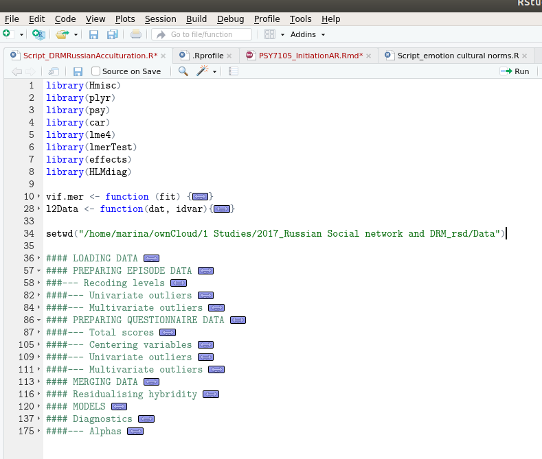
```

##

```{r, out.width="80%"}
knitr::include_graphics("rstudioHeadings2.png")
```
