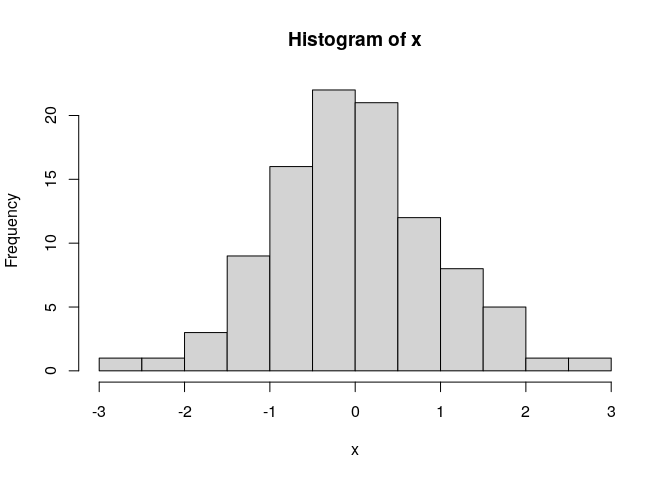

R scripts can be rendered\!
================
Jenny Bryan
April 1, 2014

This is a test to render an R script. I’m writing some prose here. Ok
enough blanla

``` r
# Creating some data
x <- rnorm(100)

# Now plotting this as a histogram
hist(x)
```

<!-- -->
